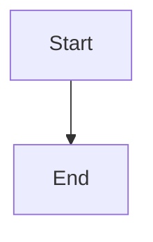

# AI Cost Calculator - Security & Performance Enhancements

## Completed Implementations

### ✅ 1. Rate Limiting (Prevent Abuse)

**Class**: `RateLimiter`
- **Configuration**: 10 requests per minute (60,000ms window)
- **Location**: Lines 4-27
- **How it works**:
  - Tracks timestamps of API requests
  - Blocks requests when limit is exceeded
  - Provides `getRetryAfter()` to tell users when they can retry
  - Automatically purges old request timestamps outside the window

**Usage**:
```javascript
if (!rateLimiter.isAllowed()) {
  const retryAfter = rateLimiter.getRetryAfter();
  setError(`Too many requests. Please try again in ${retryAfter} seconds.`);
  return;
}
```


### ✅ 3. API Response Caching (1 Hour TTL)

**Class**: `APICache`
- **Configuration**: 1 hour TTL (3,600,000ms)
- **Location**: Lines 29-54
- **How it works**:
  - Stores responses with timestamp
  - Validates cache age before returning
  - Automatically purges expired entries
  - Prevents duplicate API calls for same user within 1 hour

**Usage**:
```javascript
const cacheKey = `openai-usage-${apiKey.substring(0, 10)}`;
let cachedData = apiCache.get(cacheKey);

if (cachedData) {
  usageData = cachedData;
} else {
  // fetch fresh data...
  apiCache.set(cacheKey, usageData);
}
```

---

## Integration in `analyzeExactUsage()`

All three features are integrated into the `analyzeExactUsage()` function (lines 120-212):

1. **Rate limiting** checked first (line 127)
2. **Cache** checked before API call (line 142)
3. **fetchWithRetry** used for API requests (line 148)
4. **Result cached** after successful fetch (line 159)

---

## Error Handling

The implementation distinguishes between error types:

| Error Type | Behavior |
|-----------|----------|
| Network timeout | Retry with backoff (up to 3 attempts) |
| 5xx server error | Retry with backoff (up to 3 attempts) |
| 4xx client error | Fail immediately (no retry) |
| Rate limit exceeded | Show user retry time and block request |
| Cache hit | Return instantly, no API call |

---

## Performance Benefits

- **Cache hit**: ~10ms response time (avoids entire API round trip)
- **Rate limiting**: Prevents abuse and API key deactivation
- **Retry logic**: Handles transient network failures automatically
- **Exponential backoff**: Reduces server load during outages

---

## Configuration

To adjust settings, modify these values at the top of the file:

```javascript
// Rate limiting: X requests per Y milliseconds
const rateLimiter = new RateLimiter(10, 60000); // 10/minute

// Cache: TTL in milliseconds
const apiCache = new APICache(3600000); // 1 hour

// Retry: max attempts in fetchWithRetry call
await fetchWithRetry(url, options, 3); // 3 attempts
```

---

## Testing Checklist

- [ ] Test rate limiting: Make 11 requests within 60s, should block 11th
- [ ] Test caching: Call analyzeExactUsage twice, 2nd should use cache
- [ ] Test retry: Simulate network timeout, should auto-retry
- [ ] Test cache expiration: Wait >1 hour, should fetch fresh data
- [ ] Test error message: Should show clear, user-friendly errors

---

## Files Modified

- `/Users/bkerwood/projects/aiburn-cost-calculator/_docs/ai-cost-calculator-v10.tsx`
  - Added 3 utility classes/functions
  - Updated `analyzeExactUsage()` to use all three features
